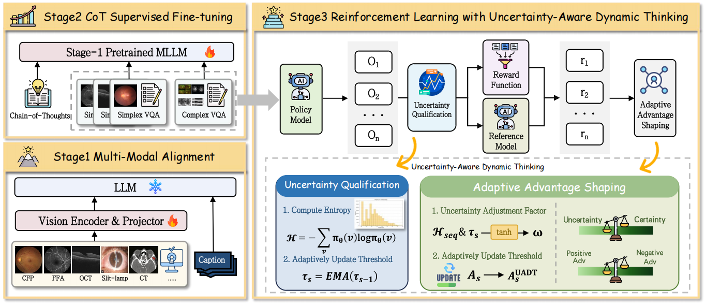
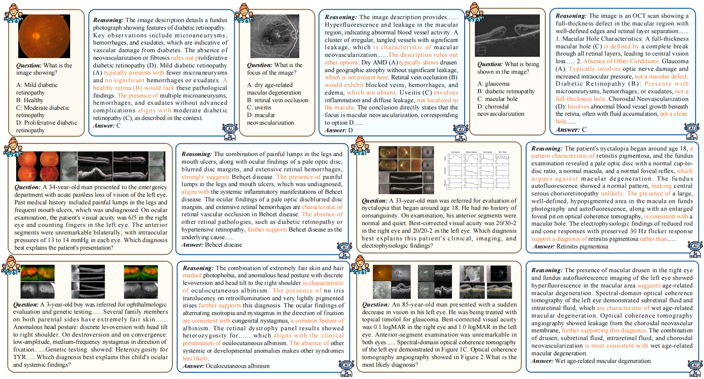

# Bridging the Gap in Ophthalmic AI: MM-Retinal-Reason Dataset and OphthaReason Model toward Dynamic Multimodal Reasoning

<div align="center">

[](https://arxiv.org/abs/2508.16129)
[](https://github.com/lxirich/OphthaReason)
[](https://huggingface.co/lxirich/OphthaReason)
[](https://huggingface.co/datasets/lxirich/MM-Retinal-Reason)

</div>

## 🔥 Overview

We introduce MM-Retinal-Reason, the first ophthalmic multimodal dataset with the full spectrum of perception and reasoning. It encompasses both basic reasoning tasks and complex reasoning tasks, aiming to enhance visual-centric fundamental reasoning capabilities and emulate realistic clinical thinking patterns. Building upon MM-Retinal-Reason, we propose OphthaReason, the first ophthalmology-specific multimodal reasoning model with step-by-step reasoning traces. To enable flexible adaptation to both basic and complex reasoning tasks, we specifically design a novel method called Uncertainty-Aware Dynamic Thinking (UADT), which estimates sample-level uncertainty via entropy and dynamically modulates the model’s exploration depth using a shaped advantage mechanism. 




## 🌈 MM-Retinal-Reason Dataset

***For more dataset details and download links, please refer to [MM-Retinal-Reason](https://huggingface.co/datasets/lxirich/MM-Retinal-Reason).***

### 1. Data Format
The format for the JSON file:
```bash
{
  "image": ["path/to/image.jpg"],
  "conversations": [
    {"from": "human", "value": "user input"},
    {"from": "gpt", "value": "assistant output"},
  ]
  "reason": "reasoning trajectory"
  "pmcid": "PMCXXX",            # only for complex reasoning
  "title": "PMC article title"  # only for complex reasoning
  "caption": "image caption"    # only for complex reasoning
}
```

### 2. Data Source 
We gratefully acknowledge the valuable contributions of all these public datasets. 

| Subset  | Dataset Composition |
| :------ | :------ |
| **CFP** | **In-Domain:** PAPILA, PARAGUAY, ARIA, APTOS, HRF, DeepDRID, G1020, AMD, PALM, ORIGA, Drishti-GS1, CHAKSU, Cataract, FUND-OCT, <br> **Out-of-Domain:** MESSIDOR, IDRID, RFMid, STARE, ROC, Retina, SUSTech-SYSU, JICHI, EYEPACS, LAG, FIVES, E-ophta, REFUGE, DR1-2, ScarDat, ACRIMA, OIA-DDR |
| **FFA** | **In-Domain:** Angiographic <br> **Out-of-Domain:** MPOS |
| **OCT** | **In-Domain:** GOALS, GAMMA1, STAGE1, STAGE2, OIMHS, OCTA_500, Large_Dataset_of_Labeled_OCT, DUKE_DME, glaucoma_detection, RetinalOCT_C8 <br> **Out-of-Domain:** OCTDL, OCTID |
| **Complex** | PubMed Central (up to June 20, 2025) | 
|


## 🌴 OphthaReason Model
### 1. Pretrain Model Download
OphthaReason adopts a three-stage training pipeline consisting of vision-language alignment, CoT supervised fine-tuning (SFT), and reinforcement learning. Specifically, we develop Uncertainty-Aware Dynamic Thinking (UADT) to leverages sample-wise entropy for adaptive reasoning. 

***OphthaReason can be downloaded from [Hugging Face Link](https://huggingface.co/lxirich/OphthaReason).***

### 2. Setup
```bash
conda create -n OphthaReason_eval python=3.10
conda activate OphthaReason_eval

git clone https://github.com/lxirich/OphthaReason.git
cd OphthaReason
pip install -r requirements_eval.txt
```
### 3. Evaluation  
* Please change the paths `BASE64_ROOT` `DS_ROOT` `OUTPUT_DIR` in `eval.py` and the model path `path/to/the/model/` in `eval.sh` to your own.
```
bash eval/eval.sh 
```


